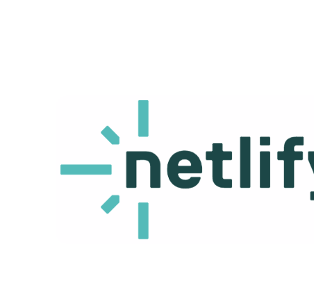
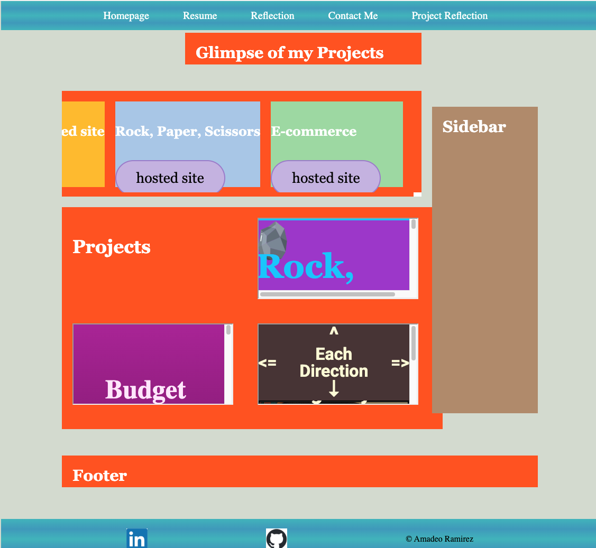

# **Portfolio Project**
This portfolio was one of my first projects, where I refactored my code and introduced SCSS for styling. I organized the styles into separate files to make updates easier across pages and to clearly distinguish where edits should be made, rather than working through a single long file.
## Project Overview 
I am still refactoring my other projects and continue to improve as I progress.
---
## **Table of Contents** 
**Requirements**
- [Page Requirements](#page-requirements)
- [Design Requirements](#design-requirements)
- [Hosted site link](#hosted-site-link)
- [Portfolio Refactor](#portfolio-refactor)
- [The contributor](#Thecontributor)
---
## Page Requirements
### HOME PAGE
- Implematation of keyframes with three images using CSS / SCSS.
- Refactored CSS into modular SCSS files to improve maintainability and scalability
- Separated layout, variables, and component styles for easier updates
### REFLECTION PAGE
- INCLUDED 3 sections
    - Professional Development
    - Technical Development
    - Personal Development
### CONTACT PAGE 
- INCLUDES
    - Form with JavaScript validation for the user.
### RESUME PAGE
- INCLUDES 
    - Updated Technical Resume with xyz-bullet points.
    - users can acces my links on my Resume.

---
## Design Requirements
- INCLUDES
    - Unique-gradient on the Navigation and footer
    - Hover feature for Social media icons
    - key frame animation for the 3 images on all pages.
    - Media queries for Responsiveness from desktop, tablet and mobile. 
---
## Hosted site link
Check it out here!
[](https://brilliant-semifreddo-64562e.netlify.app/)
---
## Portfolio Refactor
- INCLUDES
    - media Queries - The navigation was refactored to be fully responsive using media queries and a hamburger menu toggle:
    
```scss
@media (max-width: 768px) {
  .Nav-Links {
    justify-content: space-between;
    padding: 1rem 2rem;
  }
  .hamburger {
    display: flex;
  }
  .ul-List {
    position: fixed;
    top: 70px;
    left: 0;
    width: 100%;
    background: #40B5BC;
    flex-direction: column;
    display: none;
    z-index: 20;
    background: linear-gradient(360deg, #40B5BC 0%, #3c9abc 25%, #40B5BC 50%, #3c9abc 75%, #40B5BC 100%);
  }
  .ul-List li {
    width: 100%;
    padding: 1rem 2rem;
    text-align: left;
  }
}
#nav-toggle:checked ~ .ul-List {
  display: flex;
}

#nav-toggle:checked + .hamburger span:nth-child(1) {
  transform: rotate(45deg) translate(5px, 5px);
}

#nav-toggle:checked + .hamburger span:nth-child(2) {
  opacity: 0;
}

#nav-toggle:checked + .hamburger span:nth-child(3) {
  transform: rotate(-45deg) translate(6px, -6px);
}
```
 - -   
    - Implemented Semantic HTML 
    
    - - - 
    - Introduced the grid layout from section 9 of Udemy Videos. 
    

---
##  The Contributor
[](https://github.com/amadeoquinrami)
